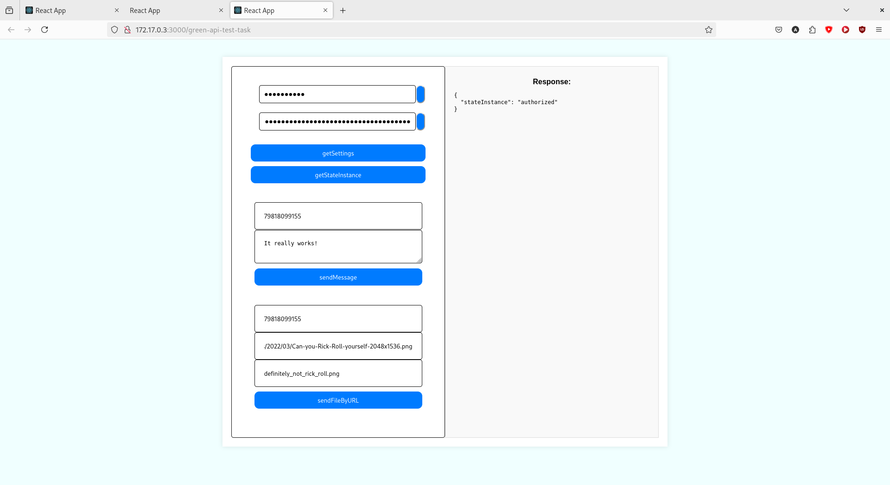

# Green API Test Task

В этом репозитории представлен исходный код тестового задания для представителей компании [Green API](https://green-api.com/).

### Стек
| JavaScript | React | NPM | Docker |
| :-----: | :-----: | :-----: | :-----: |
|| <a href="https://react.dev/" title="React"></a> | <a href="https://www.npmjs.com/" title="NPM"></a> | <a href="https://www.docker.com/" title="Docker"></a>|

Страница доступна на хостинге [Github Pages](https://Raaaawrh.github.io/green-api-test-task/).

## Задачи

Требуется создать веб-страницу, в которой будут реализованы следующие методы Green API:

- [getSettings](https://green-api.com/docs/api/account/GetSettings/)
- [getStateInstance](https://green-api.com/docs/api/account/GetStateInstance/)
- [sendMessage](https://green-api.com/docs/api/sending/SendMessage/)
- [sendFileByUrl](https://green-api.com/docs/api/sending/SendFileByUrl/)

Пользователь вводит свои данные свои IDInstance, APITokenInstance в соответсвующие защищенные поля и может вызывать методы  API getSettings и getStateInstance.

После пользователь вводит номера телефонов, тест сообщения и ссылку на файл и может отправить текстовое сообщение/файл в чат, определенный номером телефона с помощью методов API sendMessage и sendFileByUrl.

Ответы серверов на запросы появляются в поле 'Response'.

## Внешний вид


## Установка и запуск

Клонировать репозиторий и перейти в каталог с кодом.

```bash
cd /place/to/clone/repo/
git clone https://github.com/Raaaawrh/green-api-test-task/tree/main
cd green-api-test-task
```

### API URL

Вы можете использовать свой API URL для выполнения запросов. Есть 2 способа.

1. Файл `.env` (Рекомендуемый способ)

 Просто отредактируйте файл `.env`, чтобы в нем была строка `REACT_APP_API_URL=ваш_API_URL`. Или выполните в командной строке:

```bash
echo REACT_APP_API_URL{ваш_API_URL} > .env # Linux, Windows CMD или MacOS
echo "REACT_APP_API_URL{ваш_API_URL}" > .env # Windows PowerShell
```

2. Прямое указание (только Conda и нативный способ установки)

Вы можете напрямую указывать используемое значение API_URL при вызовах npm:

```bash
REACT_APP_API_URL=ваш_API_URL command # Linux, MacOS
set "REACT_APP_API_URL=ваш_API_URL" && command # Windows CMD
($env:REACT_APP_API_URL = "ваш_API_URL") -and (command) # Windows PowerShell
```
где command это одна из комманд `npm run build`, `npm run start` и `serve -s build`

Далее рекомендуется использовать методы с использованием `Docker` или `Conda`.

### 1. Docker

В системе должен быть установлен [Docker](https://www.docker.com/).


Запустить сборку Docker образа. Дождаться ее звершения и запустить контейнер.

```bash
docker build -t green-api-test-task .
docker run green-api-test-task
```

Перейти по адресу, который будет отображен в консольном выводе.

### 2. Conda

Для установки используется канал `conda-forge`.

Создать виртуальное окружение и активировать его.

```bash
conda env create --file environment.yml
conda activate green-api-test-task-env
```

В окружении доступны:

```bash
npm -v
10.8.1

npx -v
10.8.1

node -v
V22.4.0
```

Собрать проект и запустить. 

- Дебаг сборка

```bash
npm ci
npm run build
npm run start
```

- Релизная сборка

Для запуска релизной сборки локально требуется удалить поле `"homepage"` в файле `package.json` !

```bash
npm ci
npm run build
npm install -g serve
serve -s build
```

Страница будет доступна по адресам, которые появятся на экране.

### 3. Нативно

Установить [npm и node.js](https://docs.npmjs.com/downloading-and-installing-node-js-and-npm)

- Дебаг сборка

```bash
npm ci
npm run build
npm run start
```

- Релизная сборка

Для запуска релизной сборки локально требуется удалить поле `"homepage"` в файле `package.json` !

```bash
npm ci
npm run build
npm install -g serve
serve -s build
```

Страница будет доступна по адресам, которые появятся на экране.

Протестировано на OS Fedora Linux 39 и в сервисе Github Actions.